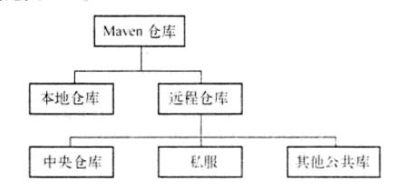
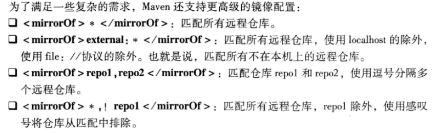
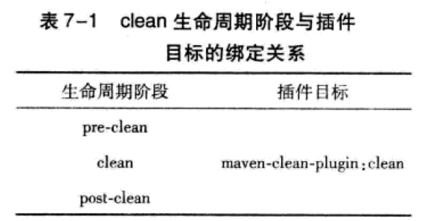
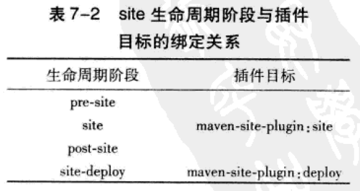
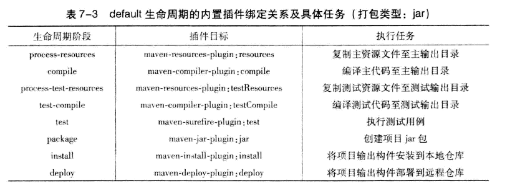
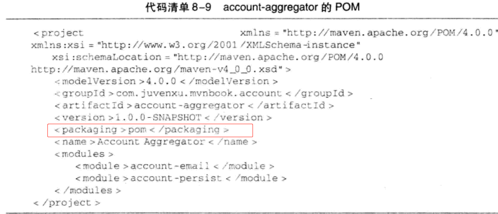
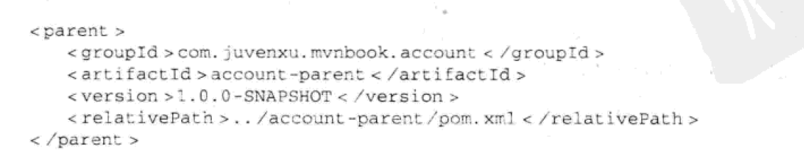
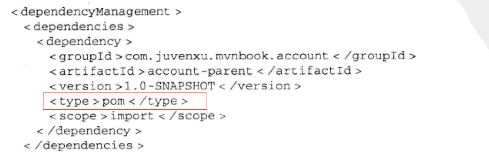

### 概述

Maven不仅是构建工具，还是一个依赖管理工具和项目信息管理工具，约定优于配置。

Maven会自动解析所有项目的直接依赖和传递性依赖，对于一些依赖冲突，也能进行调节，以确保任何一个构建只有唯一的版本在依赖中存在，最后得到的依赖被称为已解析依赖。

坐标和依赖是任何一个构件在Maven世界中的逻辑表示方式；构件的物理表示方式是文件，Maven通过仓库来统一管理这些文件。

对于Maven来说，基于发布版本，同样的坐标和版本意味着同样的构建，若本地仓库包含，则不会对照远程仓库进行更新。快照版本会根据时间戳对比，找到最新文件，快照版本只在组织内部或模块之间的依赖使用。

Maven还有两个核心概念是声明周期和插件。Maven声明周期是抽象的，其实际行为由插件来完成，两者协同工作，密不可分。

Maven的聚合特性能将项目的各个模块聚合在一起构建，继承特性能抽取各模块相同的依赖和插件等配置，保持各个模块的一致性。

### 详情

#### 坐标

Maven依赖管理的底层基础是坐标，一组Maven坐标是通过一些元素来定义的，他们是groupId，artifactId，version，packaging，classifier(用来帮助定义构建输出的一些附属构件，与主构件对应，不能直接定义项目的classifier)。

#### 依赖

##### 依赖范围

依赖范围用来控制依赖于编译、测试、运行这三种classpath的关系。

依赖传递时的关系如下图所示，最左边一行表示第一直接依赖范围，最上面一行表示第二直接依赖范围。


##### 依赖调解

当依赖冲突时，Maven依赖调解的第一原则是:路径最近着优先；第二原则是第一生命者优先。

##### 可选依赖

声明如下。

```xml
<dependency>
    <groupId>mysql</groupId>
    <artifactId>mysql-connector-java</artifactId>
    <version>5.1.46</version>
    <optional>true</optional>
</dependency>
```

根据单一职责性原则，在理想情况下，不应该使用可选项依赖。

#### mvn dependency

##### mvn dependency : list

显示所有已解析依赖，同时，每个依赖的范围也得以明确标识。

##### mvn dependency : tree

查看当前项目的依赖树。

##### mvn dependency : analyze

帮助分析当前项目的依赖。

#### 仓库

Maven仓库是基于简单文件系统存储的，路径与坐标的大致对应关系为groupId/artifactId/version/artifactId-version.packaging.

Maven仓库的分类如下图所示。



自定义本地仓库目录的地址

```xml
<!-- setting.xml -->
<setting>
	<localRepository>E://maven</localRepository>
</setting>
```

远程仓库配置(可直接配置在pom文件中)

```xml
<repositories>
		<repository>
			<!-- 任何一个仓库的ID必须是唯一的 -->
			<id>jboss</id>
			<name>JBoss Repository</name>
			<!-- 仓库的地址 -->
			<url>http://repository.jboss.com/maven2/</url>
			<!-- 表示仓库布局是Maven2和Maven3的默认布局 -->
			<layout>default</layout>
			<releases>
				<enabled>true</enabled>
				<!-- 从远程仓库检查更新的频率(每隔3分钟检查一次)-->
				<updatePolicy>interval: 3</updatePolicy>
				<!-- 检查文件的策略(遇到校验错误构建失败) -->
				<checksumPolicy>fail</checksumPolicy>
			</releases>
			<snapshots>
				<enabled>false</enabled>
			</snapshots>
		</repository>
	</repositories>
```

远程仓库认证

```xml
<!-- setting.xml -->
<servers>
    <server>
      <!-- id与需要认证的repository元素的id保持一致 -->
      <id>jboss</id>
      <username>repouser</username>
      <password>repopwd</password>
    </server>
</servers>
```

将项目生成的构建部署到仓库中

```xml
<project>
    ...
    <distributionManagement>
        <!-- 发布版本的仓库 -->
        <repository>
            <id>releases</id>
            <url>${releases.repo}</url>
        </repository>
        <!-- 快照版本的仓库 -->
        <snapshotRepository>
            <id>snapshots</id>
            <url>${snapshots.repo}</url>
        </snapshotRepository>
    </distributionManagement>
    ...
</project>
```

#### 镜像

如果仓库X可以提供仓库Y存储的所有内容，那么就可以认为X是Y的一个镜像。关于镜像更为常见的做法是结合私服，这可以将仓库配置集中到私服，私服就是所有仓库的镜像，简化Maven本身的配置。

当镜像仓库不稳定或无法提供服务时，仍将无法访问被镜像仓库。

```xml
<mirrors>
    <mirror>
      <id>mirrorId</id>
      <mirrorOf>*</mirrorOf>
      <name>Human Readable Name for this Mirror.</name>
      <url>http://my.repository.com/repo/path</url>
    </mirror>
</mirrors>
```



#### 生命周期

Maven生命周期就是为了对所有构建过程进行抽象和统一，包含了项目的清理，初始化，编译，测试，打包，集成测试，验证，部署，和站点生成等几乎所有的构建步骤，但生命周期本身不做任何实际的工作。

根据插件机制，每个构建步骤可以绑定一个或多个插件行为。

Maven有三套独立的生命周期：clean(清理项目)、default（构建项目）、site(建立项目站点)。







每个生命周期是相互独立的，但一个生命周期的阶段是有前后依赖关系的。

#### 插件目标

一个插件里的每个功能就是一个插件目标，例如maven-dependency-plugin插件能分别对应的目标为dependency:tree,dependency:list,dependency:analyze等，这是一种通用写法，冒号前面是插件，冒号后面是该插件的目标。

#### 自定义绑定

用户自己选择将某个插件目标绑定到生命周期的某个阶段上。

在bulid元素下的plugins子元素中声明插件的使用。

[Maven在线插件文档](http://maven.apache.org/plugins/index.html)

在pom中定义插件时，如果是Maven的官方插件，可以省略掉groupId，Maven内部插件解析机制会进行处理。

#### 聚合与继承

##### 聚合



packing值为pom，且配置modules。

##### 继承



可继承的POM元素

groupId：项目组ID，项目坐标的核心元素。

version：项目版本，项目坐标的核心元素。

description：项目的描述信息。

organization：项目的组织信息。

inceptionYear：项目的创始年份。

url：项目的URL地址。

developers：项目的开发者信息。

contributors：项目的开发者信息。

distributionManagement：项目的部署配置。

issueManagement：项目的缺陷跟踪系统信息。

ciManagement：项目的持续集成系统信息。

scm：项目的版本控制系统信息。

mailingLists：项目的邮件列表信息。

properties：自定义的Maven属性。

dependencies：项目的依赖配置。

dependencyManagement：项目的依赖管理配置。

repositories：项目的仓库配置。

build：包括项目的源码目录配置：输出目录配置、插件配置、插件管理配置等。

reporting：包括项目的报告输出目录配置、报告插件配置等。

在dependencyManagement元素下的依赖不会引入实际的依赖，不过它能够约束dependencies下的依赖使用，子模块只需配置简单的groupId和artifactId就能引入正确的依赖。

import范围依赖可以导入另一pom中的dependencyManagement配置。



指向了打包类型为pom的模块。

##### 插件管理

##### 反应堆

即所有模块组成的构建结构，可以通过裁剪反应堆，指定构建顺序。

#### Nexus

nexus的关注点功能有:建立各种类型的仓库，权限管理功能，调度任务功能等。

#### Maven测试

Maven的maven-surefire-plugin会自动自动执行测试源码路径中以**Test**开头和以**Test**或**TestCase**结尾的Java类。

maven-surefire-plugin是maven背后真正执行测试的插件。

其可以通过-Dtest指定运行的测试类。

cobertura-maven-plugin能生成测试覆盖率报告，mvn cobertura:cobertura。

通过`maven-jar-plugin`的`test-jar`打包测试代码, 因此目标没有内置绑定, 需要显示声明。

测试包构件使用特殊的test-jar打包类型, 如下:

```xml
<dependency>
	...
  <type>test-jar</type>
  ...
</dependency>
```


#### 持续集成

快速且高效率的**自动**构建项目的所有源码，并为项目成员提供丰富的反馈信息。

文中主要介绍的Hudson为Jenkins前身。

#### 版本管理


主版本表示了项目的重大架构变更，次版本表示较大范围的功能增加和变化，增量版本表示重大bug的修复，里程碑版本表示某一版本的里程碑，但还不是非常稳定。

对于里程碑版本只是简单的字符串比较，一次会得到1.2-beta-3>1.2-beta-11，这一点需要留意。

##### Maven Release Plugin

此插件的目标:prepare,rollback,perform,branch。

##### 项目的scm信息配置


connection表示只读的scm地址，url表示浏览器中访问的地址，developerConnection表示可写的地址。

#### 灵活的构建

##### Maven属性

内置属性，POM属性，自定义属性，setting属性，java系统属性和环境变量属性。

##### 资源过滤


目的为Maven解析资源文件中的Maven属性，进行替换。

#### 编写maven插件

步骤如下:

​	1.创建maven项目，packing为maven-plugin；

​	2.为插件编写目标(MoJo),必须继承自AbstractMoJo，并实现execute方法;

​	3.为目标提供配置点(@parameter)；

​	4.编写代码实现目标行为；

​	5.错误处理及日志；

​	6.测试插件。

